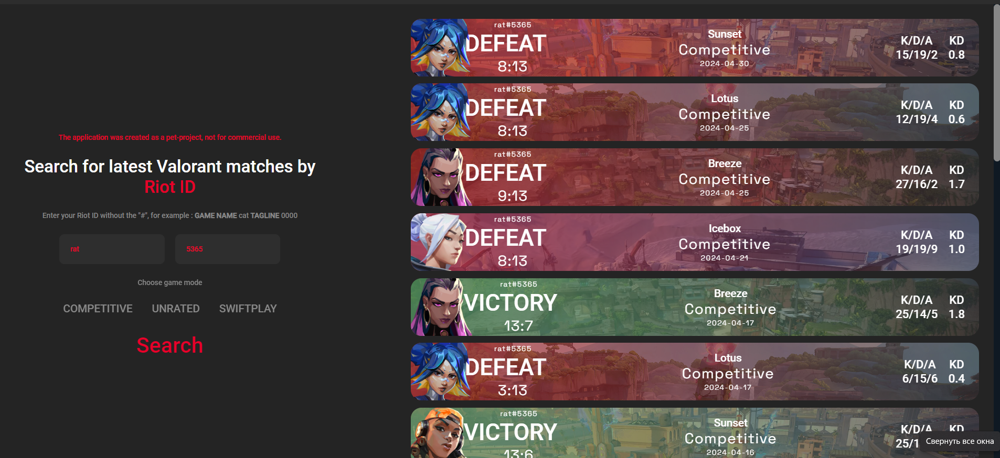

# Valorant Match Tracker

This application allows you to view your last 20 Valorant matches across Swiftplay, Competitive, and Unrated modes.

# Features:

View your last 20 matches
Track win/loss ratio and average KDA
Easy access to your recent match history

If you are unable to find your account in the tracker, it is likely because you are not registered on tracker.gg or your account is set to private.

# Getting Started:

Install dependencies: npm install
<br />
Start development server: npm run dev
<br />
Access the application at http://localhost:5173

# Technologies:

Vite: Fast development server and build tool.
React.js: JavaScript library for building user interfaces.
TypeScript: Superset of JavaScript with optional static typing.
Ant Design: UI design language and React component library.

# Account Not Found?

Ensure you are registered on tracker.gg.
Check if your account is set to public.

# React + TypeScript + Vite

This template provides a minimal setup to get React working in Vite with HMR and some ESLint rules.

Currently, two official plugins are available:

- [@vitejs/plugin-react](https://github.com/vitejs/vite-plugin-react/blob/main/packages/plugin-react/README.md) uses [Babel](https://babeljs.io/) for Fast Refresh
- [@vitejs/plugin-react-swc](https://github.com/vitejs/vite-plugin-react-swc) uses [SWC](https://swc.rs/) for Fast Refresh

## Expanding the ESLint configuration

If you are developing a production application, we recommend updating the configuration to enable type aware lint rules:

- Configure the top-level `parserOptions` property like this:

```js
export default {
  // other rules...
  parserOptions: {
    ecmaVersion: 'latest',
    sourceType: 'module',
    project: ['./tsconfig.json', './tsconfig.node.json'],
    tsconfigRootDir: __dirname,
  },
}
```

- Replace `plugin:@typescript-eslint/recommended` to `plugin:@typescript-eslint/recommended-type-checked` or `plugin:@typescript-eslint/strict-type-checked`
- Optionally add `plugin:@typescript-eslint/stylistic-type-checked`
- Install [eslint-plugin-react](https://github.com/jsx-eslint/eslint-plugin-react) and add `plugin:react/recommended` & `plugin:react/jsx-runtime` to the `extends` list
